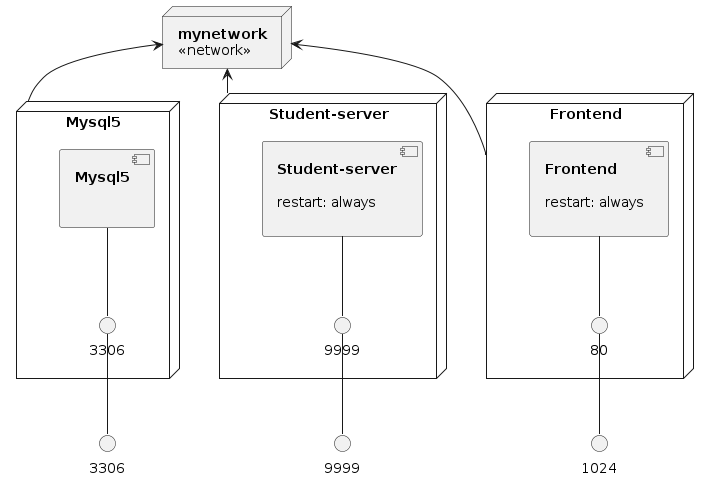

- [1. 后端打包](#1-后端打包)
- [2. 前端打包](#2-前端打包)
- [3. 运行](#3-运行)
    - [3.1. docker-compose](#31-docker-compose)
    - [3.2. K8S](#32-K8S)
- [4. 技术储备](#4-技术储备)
    - [4.1. Docker、Docker Compose](#41-dockerdocker-compose)
    - [4.2. Mysql](#42-mysql)
    - [4.3. 关于跨域问题](#43-关于跨域问题)
    - [4.4. K8S 如何进行编译部署？](#44-)
- [5. M1 Mac](#5-M1)

<!-- /TOC -->

说明：Demo有一个前端，一个后端，一个mysql服务，分别采用了 docker，docker-compose，K8S进行部署。
̦
# 1. 后端打包
```
cd student-server
mvn clean package
```

# 2. 前端打包
```
cd frontend
npm install
npm run build
```

# 3. 运行
##  3.1. docker-compose
回到上一层目录，使用docker-compose打包镜像
```docker-compose build```

启动
```docker-compose up -d```

访问页面 `localhost:1024`

停止
```docker-compose down```

##  3.2. K8S
首先修改 `k8s-quickstart.yml` 文件中的每一个 `namespace`，将 `ase-ns-00` 改为 `ase-ns-XX`

启动
```kubectl apply -f k8s-quickstart.yml```

访问
首先查看对应的 external-ip 及 port
```kubectl get svc -n ase-ns-XX```

```
NAMESPACE   NAME             TYPE           CLUSTER-IP      EXTERNAL-IP   PORT(S)          AGE
ase-ns-XX   frontend         LoadBalancer   172.21.4.194    106.15.42.5   1024:30085/TCP   4m37s
```

访问 `external-ip:1024`，即就是 `106.15.42.5:1024`

删除
```kubectl delete -f k8s-quickstart.yml```

# 4. 技术储备

##  4.1. Docker、Docker Compose
请看具体的PPT

##  4.2. Mysql
sql语句，例如创建数据库、插入数据等

##  4.3. 关于跨域问题
前端：[Vue代理解决生产环境跨域问题 部署必备干货](https://segmentfault.com/a/1190000021866670)

后端：[(SpringBoot 解决 CORS 跨域（@CrossOrigin）](https://blog.csdn.net/w_linux/article/details/81142413)

##  4.4. K8S 如何进行编译部署？

### 编译打包镜像
利用 docker-compose 打包镜像，执行第1步，第2步，第3.1步

### 推镜像到云仓库
将镜像推到阿里云镜像仓库中。

首先要创建一个[阿里云容器镜像实例](https://cr.console.aliyun.com/cn-shanghai/instances)，创建一个命名空间，查看具体的说明，可自己推镜像，也可以运行脚本推镜像。

修改脚本，然后运行脚本。注意修改脚本中的 username，password，repo_address。

```bash aliyun-push.sh```

打开[阿里云容器镜像仓库](https://cr.console.aliyun.com/cn-shanghai/instances)，查看镜像推到了仓库中，注意修改镜像仓库类型为公开。

### 运行
执行第3.2步，注意修改image地址

# 5. M1 Mac
注意 java 和 mysql的基础镜像，如果不能使用 M1 特制版的 mysql镜像，提示没有root用户，需要在 mysql/sql/init.sql 中加入

```
use mysql;
update user set Host='%' where User='root';
flush privileges;
```

### Infrastructure model

